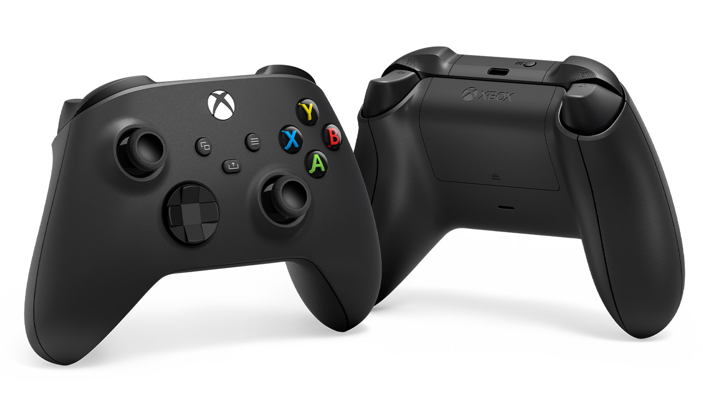

#  UR5 机器人遥操作与多模态数据采集平台 - 用户手册

## **1. 简介**

本项目提供了一套完整的解决方案，用于通过Xbox手柄实时遥操作UR5/UR5e机械臂，并同步采集多模态、多视角的数据。平台专为机器人学习领域的数据集采集而设计，支持在程序启动时定义**任务指令**和**采集频率**，并用“开始-停止”的模式循环采集同一任务的多个样本，最终以结构化的、对机器学习友好的格式进行保存。

## **✨ 主要功能**

  - **交互式任务定义**:
      - 在程序启动时，通过终端输入**自然语言指令**来定义当前批次的采集任务。
      - 支持**自定义数据采集频率**，灵活适配不同任务的需求。
  - **实时遥操作**:
      - 通过Xbox手柄进行低延迟、直观的6自由度运动控制。
  - **双模态机器人数据记录**:
      - 同步记录两种核心机器人数据，为不同的学习算法提供支持：
          - **动作 (Action)**: 7自由度的**相对位姿变化**指令 `(ΔX, ΔY, ΔZ, ΔRx, ΔRy, ΔRz, Gripper)`。
          - **状态 (State/Proprioception)**: 7自由度的**绝对TCP位姿**和夹爪状态。
  - **多视角图像同步**:
      - 同步记录来自多个异构相机（Intel RealSense D435, Stereolabs ZED 2i）的RGB及深度图像。
  - **结构化的数据输出**:
      - 数据自动按**任务指令**进行文件夹归类。
      - 每个采集样本（session）都包含独立的 `language.txt`, `robot_action.npy`, `robot_state.npy` 和图像文件夹。

## **🛠️ 环境依赖**

### **硬件 (Hardware)**

  - UR5 或 UR5e 机械臂
  - Robotiq 2F-85 二指夹爪
  - 标准 Xbox 控制器
  - Intel RealSense D435 深度相机
  - Stereolabs ZED 2i 深度相机
  - 一台连接以上所有设备的Linux工作站（本人采用Ubuntu 22.04）

### **软件 (Software)**

- Python (>= 3.8)
- **ZED SDK**: 请从 [Stereolabs官网](https://www.stereolabs.com/developers/release/) 下载并安装。
- **Python 依赖库**:
  创建一个名为 `requirements.txt` 的文件，内容如下，然后通过 `pip install -r requirements.txt` 安装。

  ```txt
  ur-rtde
  inputs
  pyrealsense2
  pyzed
  numpy
  opencv-python
  psutil
  ```


## **🚀 安装与配置**

1.  **克隆项目**
    ```bash
    git clone [您的项目仓库地址]
    cd [项目文件夹]
    ```

2.  **安装ZED SDK**
    请务必先安装与您CUDA版本匹配的ZED SDK，并根据指引完成Python API的安装。

3.  **配置机器人IP地址 (重要!)**
    打开 `src/ur5_control/ur5_controller.py` 文件，修改 `UR5Controller` 初始化时的 `robot_ip` 参数为您机械臂的实际IP地址。
    ```python
    # line 27 in ur5_controller.py
    def __init__(self, robot_ip="192.168.192.7", ...): # <-- 修改此处的IP地址
    ```

4.  **安装Python依赖**
    ```bash
    pip install -r requirements.txt
    ```

## **▶️ 运行程序**

确保所有硬件已连接并上电。进入 `src` 目录，在终端中运行主程序。推荐使用 `sudo` 以确保程序有足够的权限设置实时系统优先级。

```bash
cd src
sudo $(which python) main.py
```

## **📋 采集流程**

1.  **启动并输入参数**:

      * 程序启动后，终端会提示 `(1/2) 请输入当前任务的语言指令...`。请输入本次要采集的所有样本的共同任务描述（例如 `pick up the red block`），然后按回车。
      * 接着，终端会提示 `(2/2) 请输入数据采集频率...`。请输入您期望的采集频率（单位Hz，例如 `10`），然后按回车。

2.  **任务准备**:

      * 程序初始化完成后，您可以使用手柄自由移动机械臂到合适的起始位置。

3.  **开始录制**:

      * 当一切准备就绪，**按一下手柄上的 `Start` 键**。终端会提示“录制开始...”，程序会根据您设定的频率在后台开始记录所有数据流。

4.  **执行任务**:

      * 在录制状态下，使用手柄遥操作机械臂和夹爪，完成一个完整的操作任务。

5.  **结束并保存**:

      * 任务完成后，**按一下手柄上的 `Back` 键**。录制会立即停止，程序会自动处理并保存这段时间采集到的所有数据为一个独立的 `session` 文件夹。

6.  **重复或采集新任务**:

      * **重复采集**: 您可以重复第2步至第5步，为**同一个任务**（由启动时输入的指令决定）采集多个不同的样本。
      * **采集新任务**: 如果您想采集一个**不同**的任务，请按 `Ctrl+C` 退出当前程序，然后重新运行 `main.py` 并输入新的语言指令。

## **🎮 操作指南**


| 控制功能 | 按键 / 摇杆 |
| :--- | :--- |
| **运动控制** | |
| 前后 / 左右移动 | `左摇杆` |
| 上下移动 | `右扳机 (RT)` / `左扳机 (LT)` |
| 工具姿态旋转 (Roll/Pitch) | `右摇杆` |
| 工具姿态旋转 (Yaw) | `右肩键 (RB)` / `左肩键 (LB)` |
| **夹爪控制** | |
| 张开夹爪 | `Y` 键 |
| 闭合夹爪 | `X` 键 |
| **程序控制** | |
| 暂停/恢复机器人运动 | `A` 键 / `B` 键 |
| **开始** 数据录制 | `Start` 键 |
| **结束** 并 **保存** 数据 | `Back` 键 |
| 安全退出程序 | 在终端按 `Ctrl + C` |

## **📁 输出数据结构**

所有数据都保存在 `robot_dataset` 文件夹下，并按任务指令进行归类。

```
robot_dataset/
└── pick_up_the_red_block_demo/  <-- 以“指令_demo”命名的任务文件夹
    ├── demo_0/                 <-- 第一个样本 (Trajectory 0)
    │   ├── image0/             <-- 第三方称视角 (zed_color)
    │   ├── image1/             <-- 第一人称视角 (d435_color)
    │   ├── image3/             <-- 深度图 (d435_depth)
    │   ├── action.npy
    │   ├── state.npy
    │   └── lang.txt
    │
    └── demo_1/                 <-- 第二个样本 (Trajectory 1)
        └── ... (内部结构同上)

```

## **📊 输出数据格式详解 (更新版)**

每个 `demo_X` 文件夹都包含一个完整的、多模态的任务样本。

- **`lang.txt`**
    
    - **内容**: 纯文本文件，记录了本次任务的自然语言指令。
        
- **`action.npy`**
    
    - **格式**: NumPy数组，维度为 `(N, 7)`，其中 `N` 是总帧数。
        
    - **内容**: **动作 (Action)** 数据。每一行代表一个时间步发送给机器人的**相对位姿变化**指令，7个维度的含义是 `[ΔX, ΔY, ΔZ, ΔRx, ΔRy, ΔRz, Gripper]`。
        
- **`state.npy`**
    
    - **格式**: NumPy数组，维度为 `(N, 7)`。
        
    - **内容**: **状态 (State/Proprioception)** 数据。每一行代表一个时间步从机器人读回的**绝对TCP位姿**和夹爪状态，7个维度的含义是 `[X, Y, Z, Rx, Ry, Rz, Gripper]`。
        
- **图像文件夹**
    
    - **内容**: `image0/`, `image1/`, `image3/` 文件夹内存放着对应数据流的图像文件。
        
        - `image0`: **第三方称视角** (来自 ZED 相机)
            
        - `image1`: **第一人称视角** (来自 RealSense D435 彩色相机)
            
        - `image3`: **深度图** (来自 RealSense D435 深度相机)
            
    - **命名**: 【**重要更新**】文件名现在是**从0开始的整数序列**（如 `0.png`, `1.png`, `2.png`...），不再使用时间戳。这与标准的机器学习数据集格式完全对齐，便于数据加载器按索引读取。
        
    - **格式**: 彩色图保存为 `.jpg`，深度图为保留完整精度保存为 `.png`。
        


## **📝 注意事项**

  - **深度图查看**：保存的 `d435_depth` 图像是16位的原始深度数据，请在Python脚本中使用 `cv2.imread(path, cv2.IMREAD_UNCHANGED)` 来读取。
  - **程序退出**：如果在录制过程中使用 `Ctrl+C` 强行退出程序，程序会尝试自动保存当前已采集的数据。
